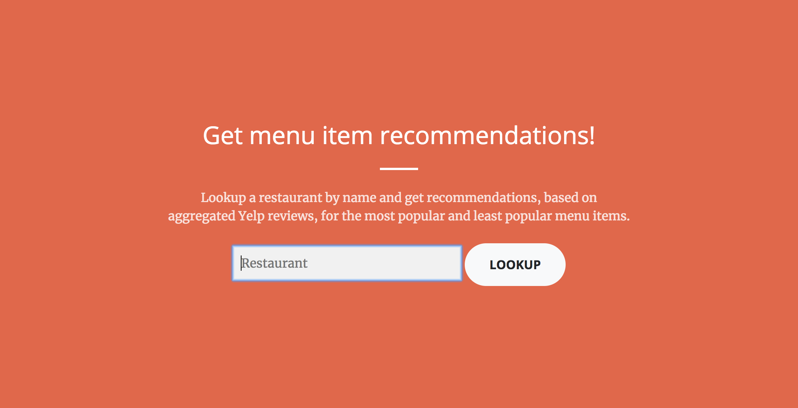

# Menu Cheatsheets NYC
**Galvanize 12 Week Data Science Immersive Program - New York, NY - September 2018**

# Background
As a food enthusiast (I hate the term 'foodie') living in New York, I rely heavily on review aggregator sites to guide my culinary adventures and satisfy my incessant appetite for discovering new restaurants (and for emptying my wallet). In fact, I can't remember the last time I visited a restaurant without checking out its Yelp page first. Like me, many people rely heavily on Yelp reviews when deciding on a place to eat. But even after picking a destination, diners are faced with more choices when sitting down and ordering from a foreign or notoriously long menu of food options (I'm looking at you, The Cheesecake Factory). In such cases, Yelp reviews come in handy again, as they contain valuable tips from past diners about dishes that they liked or disliked.

The motivation behind my project was to build a machine learning model that would perform this process so that diners would not have to manually scour reviews for menu item recommendations and instead, be able to spend a few more minutes catching up with friends at the table (or flipping through their Instagram feed). While Yelp did roll out a 'Popular Dishes' feature in June 2018 that attempts to tackle this proposition, it currently does not include information about disliked dishes. My project, on the other hand, reveals both popular and unpopular dishes for restaurants so that diners can be equally informed about what to order and what to avoid.

The final deliverable for my project is a web app, powered by my algorithm, on which users can look up a restaurant by name and receive a "cheatsheet" that contains information on the best and worst menu items, according to Yelp reviews.

# Data Collection
My project required two types of data:
1. menu items
2. restaurant reviews

Although Yelp pages contain both menu data and reviews, I found that the menu listings for a restaurant were often incomplete or outdated. As a result, I decided to gather menu data from a separate source and then later match it up to the business's Yelp reviews.

To gather the menu data, I scraped menupages.com for all available restaurants in New York, NY using BeautifulSoup. Each restaurant was stored as a dictionary, which contained information on the listed restaurant's name, address, phone number and menu items (item name, description and price).

The Yelp data was a bit trickier to get and required some scrappiness. I initially tried working with their API, named Yelp Fusion, but I was disappointed to find that the endpoint for review data only returns a maximum of three review excerpts per listing, which is way too limited for the scope of my project. Thus, I decided to scrape the reviews manually from each restaurant's page.

To get the url of each restaurant's Yelp page, which I then scraped, I used Yelp Fusion's phone search endpoint, which returns a list of businesses based on a provided phone number and data about each business, including its Yelp page url. The phone numbers I used to search were the scraped numbers from menupages.com, which would also serve as a key for me to match up these two datasets afterwards.

# Data Cleaning
After scraping both menupages.com and Yelp, I had a bit of cleaning and preprocessing to perform in order to join these disparate datasets into one and then start building my model.

The main headache for this part was that the Yelp phone search API sometimes returned multiple listings per number, usually for chain stores that share the same number or for a new business that replaced a previous one of the same location. My workaround for the latter case was to identify the listing with the same restaurant name as the menupages.com listing where the phone number came from. Afterwards, there were a few entries where none of the Yelp API results matched up with the menupages.com restaurant name listing so I just dropped these, as they made up less than 2% of the entire dataset.

I also removed menu items with prices under $3, as these were mostly beverages or small side dishes, which were not the main focus of my recommendation engine.

# Model Building
The model I used to inform my recommendations employed two main techniques in Natural Language Processing: Sentiment Analysis and Named Entity Recognition.

## Sentiment Analysis

## Named Entity Recognition

## Tfidf and Cosine Similarity

# Data Product
I ran my model on each restaurant in my dataset and then stored the results of best and worst dishes on MongoDB. Using Flask and Bootstrap, I created a web app that pulls data from MongoDB to present the results of my model for each restaurant.

# Limitations and Next Steps
Limitations:
- Model evaluation: no metric to evaluate how well the model performs
- Sentiment analysis: hard time detecting irony or sarcasm
- Named entity recognition: imperfect, sometimes misses food item mentions, sometimes misidentifies them
- Using cosine similarity to match up entities and menu items: sometimes imperfect

Given the two-week timeline for my capstone, I had to limit the scope of my project to only consider restaurants in New York City. A future goal would be to expand this product to all restaurants on Yelp.

# Tools
### Version Control
- Git
- Markdown
- Bash

### Data Collection
- Python packages:
  - BeautifulSoup
  - Requests
  - os

### Data Storage
- MongoDB
- AWS EC2
- JSON
- Python packages:
  - PyMongo
  - pickle

### Natural Language Processing
- Python packages:
  - TextBlob
  - Natural Language Toolkit
  - scikit-learn

### Data Product
- Flask
- Bootstrap
- HTML
- CSS
- JavaScript
